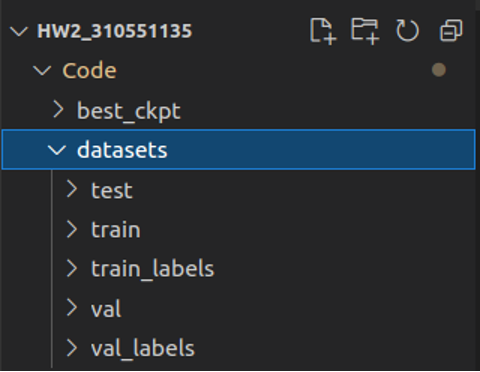

# HW2 Object Detection

Student ID: 310551135

## Re-produce training and inference
（Step 4為計算val的mAP，可跳過)

### Import environment
- `Code/environment.yml` 為本次作業的環境，可事先匯入安裝。
- 執行指令以創建conda環境
```sh
$ conda env create -f environment.yml
```

### Prepare datasets

- 將本次作業提供的datasets放置到目錄 `Code/datasets` 底下，如下圖所示：



切換到目錄 `Code` 底下，執行下方指令，將 train 和 val 的資料集，從YOLO format 轉換為 COCO format：
```sh
python yolo2coco.py
```
轉換完畢後，即可在 `datasets/annotations` 資料夾底下看到 train.json 和 val.json。

### Original

**Step 1**: Set YOLOX path \
切換到目錄 `Code/Original/YOLOX`。
先執行安裝指令，使系統路徑指向Original底下的YOLOX：
```sh
pip3 install -v -e .
```

**Step 2**: Training command \
在目錄 `Code/Original/YOLOX` 執行訓練指令：
```sh
python tools/train.py -f exps/example/custom/hw2_exp.py -d 1 -b 16 --fp16 -o -c yolox_s.pth
```

**Step 3**: Inference **test** data (with the best checkpoint) \
在目錄 `Code/Original/YOLOX` 執行推論指令，結果儲存在 `Original`：
```sh
python tools/demo.py image -f exps/example/custom/hw2_exp.py -c ../../best_ckpt/original_best_ckpt.pth --path ../../datasets/test --conf 0.25 --nms 0.45 --tsize 640 --save_result --device gpu --txt_path ../../../Original
```

**Step 4**: Inference **validation** data (with the best checkpoint)

在目錄 `Code/Original/YOLOX` 執行推論指令，預測結果儲存在 `Code/origi_val_infer_res`
```sh
python tools/demo.py image -f exps/example/custom/hw2_exp.py -c ../../best_ckpt/original_best_ckpt.pth --path ../../datasets/val --conf 0.25 --nms 0.45 --tsize 640 --save_result --device gpu --txt_path ../../origi_val_infer_res
```

計算 validation set 的mAP之前，要先轉換 val_labels 的格式（xywh -> xyrb），切換到目錄 `Code` 底下，執行指令：
```sh
python yolo2xyrb.py
```
結果將儲存在 `datasets/val_labels_xyrb`。

計算 validation set 的 mAP，切換到目錄 `Code/Object-Detection-Metrics` 底下，執行指令：
```sh
python pascalvoc.py -t 0.85 -gtformat xyrb -detformat xyrb -np --gt ../datasets/val_labels_xyrb/ --det ../origi_val_infer_res
```

### with SE module

**Step 1**: Set YOLOX path
切換到目錄 `Code/SE/YOLOX`。
先執行安裝指令，使系統路徑指向SE底下的YOLOX：
```sh
pip3 install -v -e .
```

**Step 2**: Training command
在目錄 `Code/SE/YOLOX` 執行訓練指令：
```sh
python tools/train.py -f exps/example/custom/hw2_se_exp.py -d 1 -b 16 --fp16 -o -c yolox_s.pth
```

**Step 3**: Inference **test** data (with the best checkpoint)
在目錄 `Code/SE/YOLOX` 執行推論指令：
```sh
python tools/demo.py image -f exps/example/custom/hw2_se_exp.py -c ../../best_ckpt/se_best_ckpt.pth --path ../../datasets/test --conf 0.25 --nms 0.45 --tsize 640 --save_result --device gpu --txt_path ../../../SE
```
預測結果儲存在 `SE`

**Step 4**: Inference **validation** data (with the best checkpoint)
在目錄 `Code/SE/YOLOX` 執行推論指令： 
```sh
python tools/demo.py image -f exps/example/custom/hw2_se_exp.py -c ../../best_ckpt/se_best_ckpt.pth --path ../../datasets/val --conf 0.25 --nms 0.45 --tsize 640 --save_result --device gpu --txt_path ../../se_val_infer_res
```
預測結果儲存在 `Code/se_val_infer_res`

計算 validation set 的mAP之前，要先轉換 val_labels 的格式（xywh -> xyrb），切換到目錄 `Code` 底下，執行指令：
```sh
python yolo2xyrb.py
```
結果將儲存在 `datasets/val_labels_xyrb`。

計算 validation set 的 mAP，切換到目錄 `Code/Object-Detection-Metrics` 底下，執行指令：
```sh
python pascalvoc.py -t 0.85 -gtformat xyrb -detformat xyrb -np --gt ../datasets/val_labels_xyrb/ --det ../se_val_infer_res
```